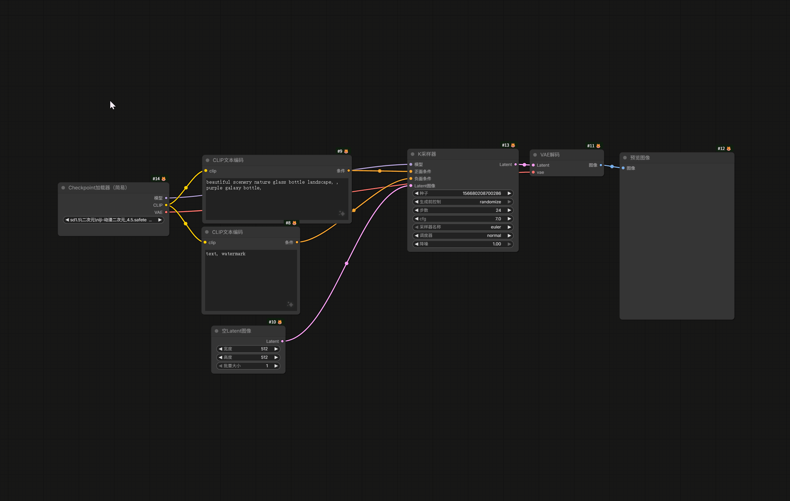
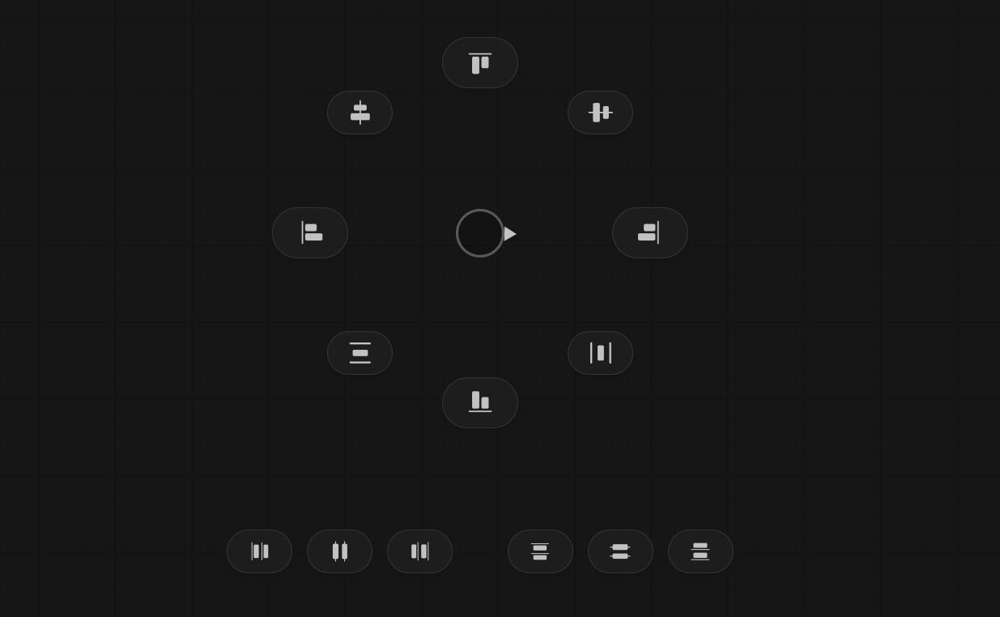

# ComfyUI Node Menu

## ComfyUI Add Node Menu (添加节点菜单)

这是一个为 ComfyUI 设计的高效节点添加工具。它提供了一个跟随鼠标的级联菜单，支持快捷键唤出、智能记忆位置、拖拽置顶和节点收藏功能，旨在极大地提升工作流搭建速度。


### ✨ 核心特性
- **快捷键唤出**：按下 `A` 键，菜单即刻在鼠标位置出现。
- **智能定位**：
    - 首次打开：菜单自动居中于鼠标。
    - 再次打开：自动记忆上次使用的分类，并将该分类对准鼠标，形成肌肉记忆。
- **拖拽置顶 (Pin)**：支持通过拖拽将常用节点或分组固定在菜单顶部。
- **节点收藏 (Favorite)**：标记常用节点，以醒目的绿色标识显示。
- **本地存储**：所有配置保存在用户目录下，方便迁移备份。

### 📖 使用指南

#### 1. 基础操作

- **唤出菜单**：在画布空白处（不要聚焦在输入框内），按下键盘上的 **`A`** 键。
- **添加节点**：点击菜单项即可将节点添加到**唤出菜单时鼠标所在的坐标**。
- **关闭菜单**：点击屏幕任意空白处，或按下 `Esc` 键。

#### 2. 置顶功能 (Pinning)

置顶功能允许你将常用的节点或全部分组固定在当前列表的最上方。

- **添加置顶**：
    - **方法一（右键）**：在任意节点或分组上 **右键点击**，选择 `⭐ 置顶 (Pin)`。
    - **方法二（拖拽）**：按住节点或分组，将其拖拽到菜单列表的 **最上方**（或分隔线以上区域）。
    - **添加第一个置顶**：如果当前没有置顶项，直接将节点拖拽到菜单容器的**顶部边缘**，顶部会亮起蓝色光条，松开即可添加。
- **调整顺序**：在置顶区域内，可以通过拖拽上下移动来调整排列顺序。
- **取消置顶**：
    - **右键点击**置顶项，选择 `⭐ 取消置顶 (Unpin)`。
    - 或者将置顶项**拖拽**到下方的普通列表区域（显示红色背景），松开即可移除。

> 视觉提示：置顶项的背景色会比普通项稍深。
> 

#### 3. 收藏功能 (Favorites)

收藏功能用于高亮标记你喜欢的节点，方便在长列表中快速识别。

- **操作**：在节点或分组上 **右键点击**，选择 `❤️ 收藏 (Favorite)`。
- **视觉效果**：已收藏的节点左侧会出现一条 **鲜艳的绿色竖线**。

#### 4. 菜单分类逻辑

一级菜单分为三个区域（由上至下）：

1. **系统常用/置顶区**：包含被你置顶的分组，以及系统默认的常用分组（如 Utils, Sampling, Image 等）。
2. **普通分组区**：按字母顺序排列的其他节点分组。
3. **其他 (Others)**：未分类的节点。

### 💾 数据存储与迁移

本插件的所有用户配置（置顶、收藏、最后位置）均保存在 ComfyUI 的用户数据目录中，**不会因为清除浏览器缓存而丢失**。

- **数据路径**：
`ComfyUI/user/AlignLayout/`
- **文件说明**：
    - `add_node_menu_pins.json`: 记录置顶信息。
    - `add_node_menu_quick.json`: 记录收藏信息。
    - `add_node_menu_last_category.json`: 记录最后一次打开的分类位置。

**如何迁移？**
如果你更换电脑或重装 ComfyUI，只需备份并复制 `ComfyUI/user/AlignLayout/` 文件夹到新环境即可保留所有习惯设置。

### 常见问题 (Q&A)

**Q: 按下 A 键没有反应？**
A: 请确保：

1. 你的鼠标焦点不在提示词输入框或搜索框内。
2. 并没有按住 Ctrl、Shift 或 Alt 等组合键。
3. 检查浏览器控制台 (F12) 是否有报错。

**Q: 收藏了某个分组，为什么里面的节点没有变绿？**
A: 收藏是独立的。收藏分组只会标记该分组本身（方便在一级菜单看到），不会级联标记其内部的所有子节点。

**Q: 置顶是全局的吗？**
A: 不完全是。置顶是“层级内”的。

- 在主菜单置顶“图像”分组，它会在主菜单置顶。
- 在“图像”分组内置顶“Load Image”节点，它只会在“图像”分组内置顶。

## ComfyUI Quick Node Menu (快捷节点菜单)

这是一个为 ComfyUI 设计的**高频节点极速访问工具**。它与 "Add Node Menu" 完美配合，专门用于展示你**收藏 (Favorite)** 的节点和分组，通过精简的列表让你专注于核心工作流。


### ✨ 核心特性

- **极速唤出**：按下 **`Q`** 键，仅包含你最爱节点的菜单即刻出现。
- **数据联动**：自动读取并同步你在 Add Node Menu (按 `A` 键) 中“收藏”的内容。
- **独立置顶**：拥有独立的置顶 (Pin) 逻辑。你可以在这里将“收藏中的最爱”再次置顶，与主菜单互不干扰。
- **快速管理**：支持直接在菜单中右键移除不再需要的收藏项。
- **视觉区分**：采用紫色系高亮风格，与主菜单的蓝色风格区分，防止混淆。

### 📖 使用指南

#### 1. 如何填充内容？

Quick Menu 默认是空的。你需要先通过 Add Node Menu 添加内容：

1. 按下 **`A`** 键打开主菜单。
2. 在任意节点或分组上 **右键点击**。
3. 选择 **`❤️ 收藏 (Favorite)`**。
4. 现在，按下 **`Q`** 键，该项就会出现在 Quick Menu 中了。

#### 2. 基础操作

- **唤出菜单**：在画布空白处，按下键盘上的 **`Q`** 键。
- **添加节点**：点击菜单项即可将节点添加到鼠标当前位置。
- **移除收藏**：
    - 在 Quick Menu 的根目录下，**右键点击**任意项。
    - 选择 **`移除 (Remove)`**。
    - 该项将从收藏列表中删除（同时也会在 Add Node Menu 中取消收藏标记）。

#### 3. 独立置顶 (Pinning)

Quick Menu 的置顶是**完全独立**的。你可以在这里通过置顶来调整收藏项的排序，而不会影响 Add Node Menu 的排序。

- **操作方式**：
    - **右键**：点击项，选择 `置顶 (Pin)`。
    - **拖拽**：按住项，将其拖拽到菜单列表的**最上方**。
- **调整顺序**：在置顶区域内，拖拽上下移动即可调整顺序。

#### 4. 互斥显示

为了保持界面整洁，当你按下 `Q` 键时，如果屏幕上已打开了 `A` 键菜单，它会自动关闭，反之亦然。屏幕上永远只会存在一个菜单。

### 💾 数据存储

Quick Menu 与 Add Node Menu 共享收藏数据，但拥有独立的配置文件：

- **数据路径**：`ComfyUI/user/AlignLayout/`
- **文件说明**：
    - `add_node_menu_quick.json` (🔴 **核心共享文件**)：存储所有被“收藏”的节点和分组数据。Quick Menu 读取此文件显示内容。
    - `quick_menu_pins.json` (🔵 **独立文件**)：仅记录 Quick Menu 内部的置顶排序。
    - `quick_menu_last_category.json` (🔵 **独立文件**)：记录 Quick Menu 上次打开的位置。

### 常见问题 (Q&A)

**Q: 按下 Q 键提示 "Quick Menu is empty"？**
A: 请先按 `A` 打开主菜单，右键点击你常用的节点选择“收藏”，然后再按 `Q`。

**Q: 我在 Quick Menu 里置顶了节点，按 A 键的主菜单里也会置顶吗？**
A: **不会**。两者的置顶系统是分开的。这允许你在主菜单保留一套通用的置顶逻辑，而在 Quick Menu 建立一套针对特定任务的置顶逻辑。

**Q: 如果我删除了 Add Node Menu 插件，这个还能用吗？**
A: Quick Menu 依赖 `add_node_menu_quick.json` 数据文件。虽然理论上代码分离了，但设计逻辑上它们是伴生关系，建议同时保留。


# ComfyUI-AlignLayout

这是一个专为 ComfyUI 设计的生产力增强扩展，旨在通过直观的 **径向菜单 (Radial Menu)** 和 **鼠标甩动手势 (Mouse Flick)**，极大地提升节点对齐、分布以及尺寸调整的效率。

## 🚀 核心特性

- **双模操作**：支持精确的“点击触发”和极速的“甩动触发”。
     
     
- **径向对齐面板 (Alt + A)**：
     
    - 8 个方向的对齐与分布功能：左/右/顶/底对齐、水平/垂直居中对齐、水平/垂直间距分布。
    - 底部 6 个常用锚点分布按钮：水平左分布、水平居中分布、水平右分布、垂直顶分布、垂直居中分布、垂直底分布
- **径向拉伸面板 (Alt + S)**：
     
    - 单侧拉伸（保持另一侧不动）。
    - 支持匹配最大宽度/高度。
    - 一键恢复 **默认尺寸 (320px 宽度)** 或 **最小尺寸**（自适应组件）。
- **智能交互**：
    - **位置自适应**：面板在当前鼠标位置弹出，操作路径极短。
    - **方向指示器**：中心带三角形的小圆环，实时指向鼠标甩动方向。
    - **互斥机制**：两个面板不会同时出现，切换无缝。

## 🛠️ 安装方法（

1. 打开终端，进入你的 ComfyUI 根目录。
   ```
   cd custom_nodes
   ```
2. 执行克隆命令：
    
    ```
    git clone https://github.com/pixixai/ComfyUI-AlignLayout.git
    
    ```
    
3. 重启 ComfyUI。

## ⌨️ 快捷键说明

| 快捷键 | 功能 |
| --- | --- |
| **Alt + A** | 呼叫 **对齐面板 (Align)** |
| **Alt + S** | 呼叫 **拉伸面板 (Stretch/Resize)** |

### 💡 小贴士：如何使用“甩动”手势？

按下快捷键后不要松开鼠标，直接快速向目标按钮的方向“甩”出鼠标，功能将瞬间执行并关闭面板。如果你移动较慢，系统会判断为“点击模式”，此时你可以正常点击任何按钮。

## 📁 目录结构

```
ComfyUI-AlignLayout/
├── __init__.py          # 插件加载引导
├── web/
│   ├── align_plugin.js   # 对齐面板逻辑
│   └── stretch_plugin.js # 拉伸面板逻辑
└── README.md
```
# 整合参考
此项目部分灵感参考自 https://github.com/Moooonet/ComfyUI-Align.git 。