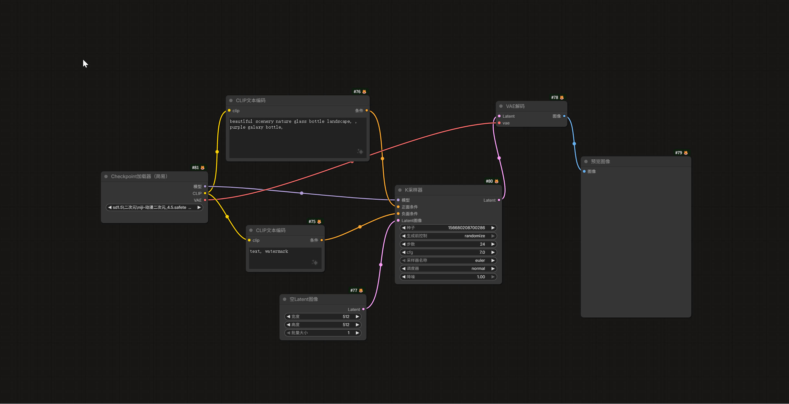
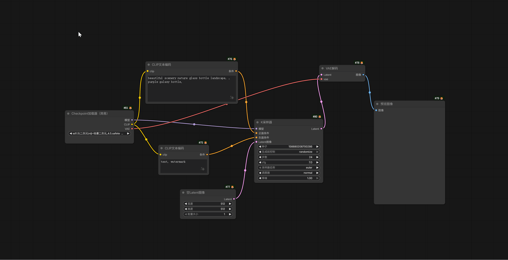

## 📐 对齐面板 (Align Panel)

**快捷键**: `Alt + A` (默认，可在设置中修改)

对齐面板专为解决 ComfyUI 节点排列杂乱的问题而设计。通过直观的径向菜单和底部控制栏，你可以快速将选中的多个节点对齐到同一基准线、均匀分布，甚至一键自动重新布局整个工作流。

### ✨ 核心亮点

#### 双模操作体验 (效率极高)

- **点击触发**：像传统菜单一样，移动鼠标点击按钮即可执行操作。
  
  
- **甩动触发 (Mouse Flick)**：按下快捷键后**不松开鼠标**，快速向圆环上按钮的方向“甩”动一段距离，即可瞬间触发功能并关闭面板。这是肌肉记忆形成后的最高效操作方式！
  
  

#### 智能交互设计

- **位置自适应**：面板永远在当前鼠标位置弹出，操作路径极短。
- **动态指示器**: 面板中心的三角形会实时跟随你的鼠标，指示即将触发的方向。
- **自动退出**：完成操作、点击空白处或取消节点选中时，面板自动关闭，不干扰视线。

### 🎮 功能布局 (默认配置)

面板分为两个主要区域：**环形菜单** 和 **底部控制栏**。
*注意：所有按钮的功能都可以在设置中完全自定义。以下介绍基于默认配置。*

#### 1. 环形菜单 (Ring Menu)

环形菜单包含 8 个方向，涵盖了最常用的对齐与分布功能。

#### 基础对齐 (十字方向)

- **⬆️ 上 (Top Align)**: 顶对齐。将所有节点顶部边缘对齐到最高节点的上边界。
- **⬇️ 下 (Bottom Align)**: 底对齐。将所有节点底部边缘对齐到最低节点的下边界。
- **⬅️ 左 (Left Align)**: 左对齐。将所有节点左侧边缘对齐到最左节点的左边界。
- **➡️ 右 (Right Align)**: 右对齐。将所有节点右侧边缘对齐到最右节点的右边界。

#### 居中与分布 (斜角方向)

- **↖️ 左上 (Horizontal Center)**: 水平居中。对齐所有节点的水平中心线。
- **↗️ 右上 (Vertical Center)**: 垂直居中。对齐所有节点的垂直中心线。
- **↙️ 左下 (Distribute V)**: 垂直平均分布。在最上和最下节点之间，将中间节点按**等间距**垂直排列。
- **↘️ 右下 (Distribute H)**: 水平平均分布。在最左和最右节点之间，将中间节点按**等间距**水平排列。

#### 2. 底部控制栏 (Bottom Bar)

底部包含 3 个强大的高级功能按钮，左右两侧按钮支持数值输入。

- **Left (左侧胶囊)**: **📏 垂直指定间距 (Stack Vertically)**
    - 将选中节点在垂直方向上紧凑排列。
    - **数值输入**: 在胶囊左侧输入数字（如 `50`），表示节点之间的固定像素间距。
    - *适用场景：整理一列参数节点，使其紧凑且间距一致。*
- **Center (中间圆形)**: **✨ 自动布局 (Auto Layout)**
    - 基于节点连接关系，自动重新排列选中的节点（如未选中则排列全图）。
    - *适用场景：一键拯救杂乱无章的“意大利面条”连线。*
- **Right (右侧胶囊)**: **📏 水平指定间距 (Stack Horizontally)**
    - 将选中节点在水平方向上紧凑排列。
    - **数值输入**: 在胶囊左侧输入数字，控制节点间距。
    - *适用场景：整理一行流程节点。*

### ⚙️ 设置与自定义 (Settings)

本插件具有极高的可配置性。在 ComfyUI 的设置菜单中找到 **NodeAligner** 分类。

#### 1. 按钮功能自定义 (Button Remapping)

你可以重新定义面板上 **11 个按钮**（环形8个 + 底部3个）的具体功能。
可选功能包括：

- 上/下/左/右对齐
- 垂直/水平居中
- 垂直/水平平均分布 (Distribute)
- 垂直/水平指定间距 (Stack，支持输入数值)
- 自动布局 (Auto Layout)

#### 2. 自动布局设置 (Auto Layout)

- **Layout Direction**: 选择布局流向（从左到右 / 从右到左）。
- **Horizontal/Vertical Spacing**: 调整自动布局时的节点间距。

#### 3. 手势与外观

- **Menu Radius**: 调整环形菜单的大小。
- **Flick Distance/Speed**: 调整“甩动触发”的灵敏度，防止误触。
- **Shortcut**: 修改呼出面板的快捷键。