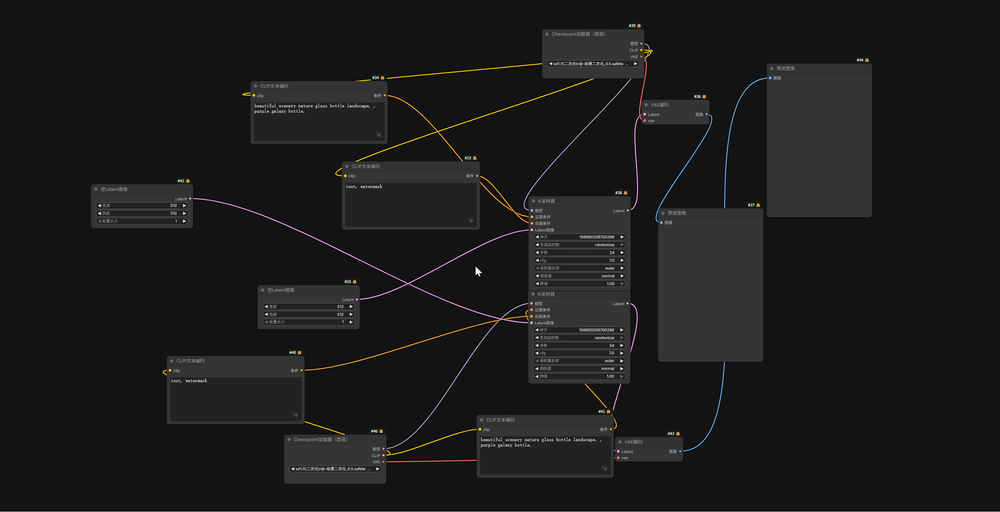

# Auto Layout

**Auto Layout** 是一个轻量级但功能强大的 ComfyUI 扩展插件，旨在通过智能算法一键自动整理和排列您的工作流节点，让乱糟糟的画布瞬间变得井井有条。

## ✨ 主要功能 (Features)

- **智能流式布局 (Smart Flow Layout)**
    - **独立流分组**：自动识别互不相关的节点组（连通分量），将它们分开计算和排列，互不干扰。
    - **逆向推导模式（默认/推荐）**：以输出节点（如 `Save Image`）为终点，从右向左反向推导。同一列节点**向右对齐**，确保连线端口整齐划一。
    - **正向模式**：传统的从左向右排列。同一列节点**向左对齐**。
- **局部与全局整理 (Selection Aware)**
    - **局部整理**：选中一组节点，按下快捷键，仅自动排列选中的节点，不影响画布其他部分。
    - **全局整理**：点击画布空白处（取消所有选择），按下快捷键，自动整理整个工作流。
- **智能对齐与防重叠**
    - **端口感知排序**：同一列的节点会根据它们连接到下一列节点的**输入端口顺序**进行上下排列（例如：连接到 `Model` 端口的节点会排在连接到 `VAE` 端口的节点上方）。
    - **智能顶对齐**：单输出节点会自动与其目标节点进行顶部对齐，视觉更整洁。
    - **防碰撞机制**：自动计算节点尺寸，防止节点重叠。
- **高度可配置 (Fully Configurable)**
    - 支持自定义**水平间距**和**垂直间距**。
    - 支持自定义**快捷键**（默认为 `Alt+L`，支持组合键如 `Ctrl+Shift+K`）。
    - 原生集成到 ComfyUI 设置面板，支持多语言（中文/英文）。

## 🚀 使用方法 (Usage)

### 快捷键

默认快捷键为 **`Alt + L`**。

### 操作演示

1. **整理选中的节点**：
    - 使用鼠标框选一部分乱序的节点。
    - 按下 `Alt + L`。
    - 节点将在当前位置附近自动吸附并排列整齐。
2. **整理所有节点**：
    - 点击画布空白处确保没有节点被选中。
    - 按下 `Alt + L`。
    - 所有节点将以画布右侧（逆向模式）或左侧（正向模式）为基准重新排列。

> 提示：该操作支持撤销！如果不满意自动排列的结果，请按下 Ctrl + Z 即可恢复原状。
> 

## ⚙️ 设置说明 (Configuration)

点击 ComfyUI 菜单栏的 **设置 (Settings)** 图标（齿轮），在左侧侧边栏找到 **"AlignLayout"** 选项卡。

### Auto Layout (自动布局)

- **Layout Direction (布局方向)**
    - **Right-to-Left (逆向 - 推荐)**：从右向左排列，适合大部分生图工作流。同一列节点向右对齐。
    - **Left-to-Right (正向)**：从左向右排列。同一列节点向左对齐。
- **Horizontal Spacing (水平间距)**
    - 控制列与列之间的像素距离。默认为 `80`。
- **Vertical Spacing (垂直间距)**
    - 控制同一列中节点之间的垂直像素距离。默认为 `60`。
- **Shortcut (快捷键)**
    - 自定义触发自动布局的组合键。
    - 格式示例：`Alt+L`、`Ctrl+Shift+K`。默认为 `Alt+L`。

## 🤝 贡献 (Contributing)

欢迎提交 Issues 和 Pull Requests 来改进布局算法或添加新功能！

## 📄 许可证 (License)

MIT License