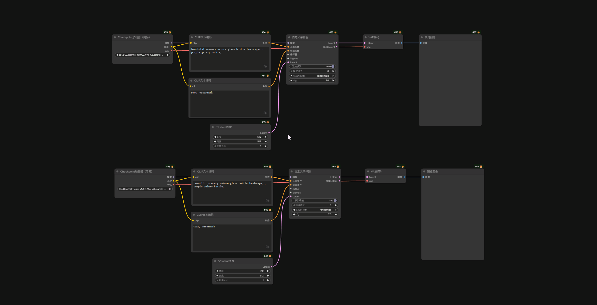

## 🔗 快速连接 (Fast Link)

**ComfyUI Fast Link** 是一个旨在提升节点连接效率的纯前端插件。它通过智能的空间排序算法和快捷键逻辑，帮助用户实现极速的多对一、一对多、链式连接以及端口切换等操作。

### 🎹 快捷键速查表

> 注意：以下快捷键中的 F 为默认设置，你可以在 ComfyUI 设置面板中自定义为主键（例如改 为 J 或 K）。

| 快捷键 | 模式名称 | 单次按下行为 | 多次连续按下行为 (轮询) |
| :-------: | :--------: | --- | --- |
| **`F`** | **多对一 (汇聚)** | 将左侧/上方所有节点的输出，连接到最右侧/下方节点的输入。 | **切换终点接口**：在目标节点的不同输入端口间轮询切换。 |
| **`Shift + F`** | **一对多 (广播)** | 将最左侧/上方节点的输出，连接到其余所有节点的输入。 | **切换起点接口**：在源节点的不同输出端口间轮询切换。 |
| **`Ctrl + F`** | **强制多对一** | **强制**将左侧所有节点连接到终点（会断开旧连接）。 | **切换源节点**：在左侧的源节点列表中依次切换，每次只连接一个源到终点。 |
| **`Ctrl + Shift + F`** | **强制一对多** | **强制**将起点节点连接到右侧所有节点（会断开旧连接）。 | **切换目标节点**：在右侧的目标节点列表中依次切换，每次只连接起点到一个目标。 |
| **`Alt + F`** | **链式连接** | 按照视觉顺序依次连接节点 (1→2→3→4)。 | *(重新执行连接计算)* |
| **`Ctrl + Shift + Alt + F`** | **清除内部连线** | **仅断开**当前选中节点之间**内部**互相连接的线，不影响连接到外部的线。 | - |

### ⚙️ 设置选项说明

你可以在 ComfyUI 的设置面板中找到 **"AlignLayout > FastLink"** 分类，进行以下配置：

1. **启用 Fast Link 插件 (Enable Fast Link)**
    - 全局开关，一键禁用插件功能。
2. **全局快捷键 (Shortcut Key)**
    - 默认为 `F`。你可以将其修改为任何单字母按键（不区分大小写）。修改后，上述所有组合键将基于新按键生效。
3. **垂直堆叠判定阈值 (Vertical Stack Threshold)**
    - **默认值 0.8**。
    - 控制“多对一”和“链式连接”时的排序逻辑。只有当两个节点的**水平重叠部分**超过较小节点宽度的 **80%** 时，插件才会认为它们是“垂直排列”的（按上下排序）；否则视为“水平排列”（按左右排序）。
    - *调小此值（如 0.5）会让错位摆放的节点更容易被判定为垂直列。*
4. **模式重置超时 (Mode Reset Timeout)**
    - **默认值 2000ms**。
    - 当你连续按键进行“接口切换”或“节点轮播”时，如果停止操作超过这个时间，计数器会重置。下次再按将重新开始，而不是继续切换。
5. **端口匹配优先级 (Port Match Priority)**
    - **名称 + 类型 (严格)**：默认值。优先连接名称和类型都相同的端口（3分），其次连接仅类型相同的端口（2分）。
    - **仅类型 (宽松)**：忽略端口名称，只要类型匹配（如 IMAGE 连 IMAGE）就视为最高优先级。适合不规范命名的节点。

### 🛠️ 详细功能逻辑

#### 1. 智能保护与切换

- **非强制模式 (`F`, `Shift+F`)**：
    - 第一次按下时，**绝对不会**断开目标端口已有的连线，只会填补空位。
    - **轮询切换时**：当你连续按下快捷键（触发切换逻辑），插件会自动清理掉**上一次轮询产生的那条连线**，以便连接到新的接口。这保证了画面的整洁，同时不会误伤其他不想动的连线。
- **强制模式 (`Ctrl+...`)**：
    - 总是优先尝试断开目标端口的旧连线，确保当前的源节点能连上。

#### 2. 清除内部连线 (`Ctrl+Shift+Alt+F`)

- 这是一个非常实用的清理工具。
- **场景**：你选中了节点 A, B, C。其中 A 连着 B，B 连着 C，C 连着外部的节点 D。
- **操作**：按下此快捷键。
- **结果**：A->B 和 B->C 的线断开。C->D 的线**保留**（因为 D 不在选区内）。

### 🧠 核心算法机制

#### A. 视觉列排序 (Visual Column Sort)

- **应用场景**：`F`, `Ctrl+F`, `Alt+F`
- **原理**：利用“垂直堆叠判定阈值”来智能识别你的布局是“横向流”还是“纵向栈”。完美解决了错位布局（半重叠）时的连接顺序混乱问题。

#### B. 严格左上排序 (Strict Left Sort)

- **应用场景**：`Shift + F`, `Ctrl+Shift+F`
- **原理**：严格寻找坐标最左（其次最上）的节点作为发射源，符合“广播”操作的直觉。