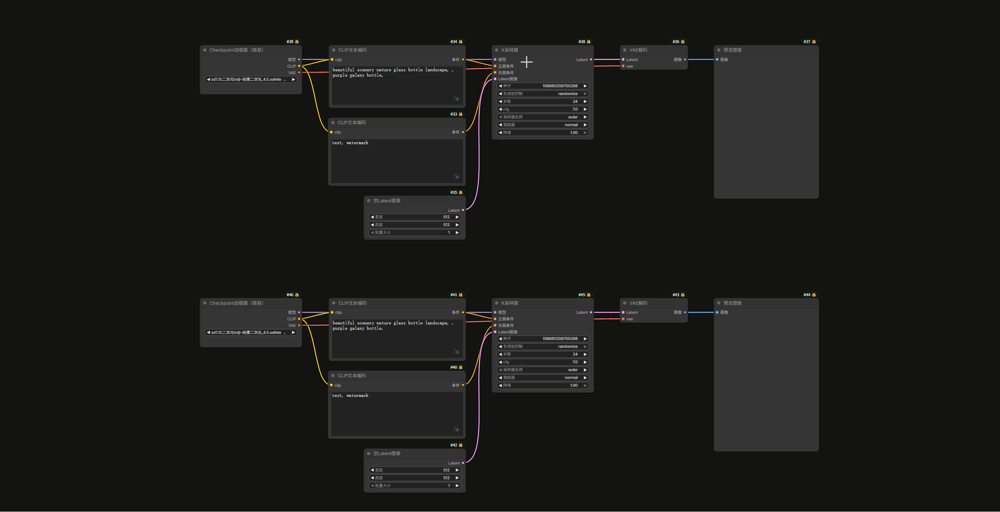

## 🔄 替换节点 (Replace Node)

**替换节点** 是一个强大的工作流编辑工具，它允许你以“热替换”的方式，将旧节点替换为任意新节点，同时**自动保留并迁移原有的输入、输出连线以及参数值**。

该功能采用独特的“交互模式”设计，并支持自动呼出搜索面板，极大地提升了编辑效率。

### 🎮 操作流程

#### 第一步：进入替换模式

1. 选中画布上一个或多个需要被替换的节点（批量替换时，选中的节点必须是相同类型的）。
2. 将鼠标悬停在画布的任意空白位置（推荐）。
3. 按下默认快捷键 **`Shift + R`**。

#### 第二步：选择新节点

进入模式后，插件会立即执行以下动作：

1. **视觉反馈**：被选中的旧节点将显示**金色高亮边框**和**呼吸光晕**，表示已进入“待替换状态”。
2. **自动呼出菜单**：默认情况下，**“节点搜索框”会自动在你的鼠标位置弹出**。
*(你不再需要手动双击画布空白处，直接输入关键词即可)*

> 补充方式：如果你不小心关闭了自动弹出的搜索框，保持在“替换模式”下（高亮未消失），你依然可以使用任意方式添加新节点（如右键菜单、拖拽、从剪贴板粘贴），它们都会触发替换逻辑。
> 

#### 第三步：自动替换

一旦你从搜索框中选中了新节点：

1. 插件会自动删除刚才高亮的旧节点。
2. 在**旧节点的位置**生成新的节点实例。
3. **智能重连**：自动迁移旧节点的连线和 Widget 值到新节点。
4. 自动退出替换模式，并选中所有新节点。

> 提示：如果在替换模式下不想替换了，再次按下 Shift + R 或点击空白处即可退出模式，高亮消失。
> 

### 🧠 智能迁移逻辑

当旧节点被替换为新节点时，插件会按照以下优先策略迁移数据：

1. **完全匹配**：端口名称 (Name) 和 数据类型 (Type) 完全一致。
2. **名称匹配**：端口名称一致（类型可能不同）。
3. **类型唯一匹配**：如果旧节点有一个 `IMAGE` 类型的端口，而新节点也**只有唯一一个** `IMAGE` 类型的端口，会自动连接。
4. **强制顺序连接 (兜底策略)**：
    - 如果开启了 **Force Connection**（默认开启），当上述匹配都失败时，插件会尝试按照端口的顺序（第1个连第1个，第2个连第2个...）进行连接。
    - 这意味着即使类型不匹配（如将 `INT` 连到 `FLOAT`），连线也会被保留。这对于快速替换结构相似但定义不同的节点非常有用。
    - 如果关闭此选项，类型不匹配的连线将被断开。

#### 特殊支持

- **动态数组节点**：对于像 `PixNodes` 这类支持 `image_1`, `image_2` 动态扩展的节点，插件会自动添加缺失的端口以容纳所有连线。
- **JSON 合并节点**：对于 `JsonObjectCombine` 这类根据输入文本生成端口的节点，插件会自动分析旧连线并配置新节点。

### ⚙️ 设置与自定义

你可以在 ComfyUI 设置面板的 `AlignLayout` -> `Replace Node` 分类中深度定制该功能：

#### 基础与行为

- **Enable Replace Node**
    - 说明：开启/关闭功能。
    - 默认值：`True`
- **Auto Open Menu (新功能)**
    - 说明：进入替换模式后自动打开的菜单类型。
    - 选项：
        - `Search Box (Default)`: 自动打开节点搜索框（跟随鼠标位置）。
        - `Add Node Menu`: 自动打开分类菜单。
        - `Quick Node Menu`: 自动打开收藏夹菜单。
        - `None`: 不自动打开任何菜单，仅高亮节点。
- **Force Connection**
    - 说明：是否开启强制顺序连接。建议开启，可最大化保留连线。
    - 默认值：`True`
- **Shortcut**
    - 说明：自定义快捷键。
    - 默认值：`Shift+R`

#### 视觉样式 (Visual Style)

你可以自定义“替换模式”下的高亮外观，使其符合你的主题偏好：

- **Highlight Color**: 高亮的主题色（支持 Hex 格式，如 `#FF0000` 红色，`#00FFFF` 青色）。
- **Fill Opacity**: 高亮填充的透明度（0.0 - 1.0）。
- **Glow Strength**: 边缘发光/模糊的强度。
- **Stroke Width**: 高亮边框的线条粗细。

*注：本功能支持撤销（Undo）。如果替换结果不符合预期，按下 `Ctrl+Z` 即可完全恢复到替换前的状态。*