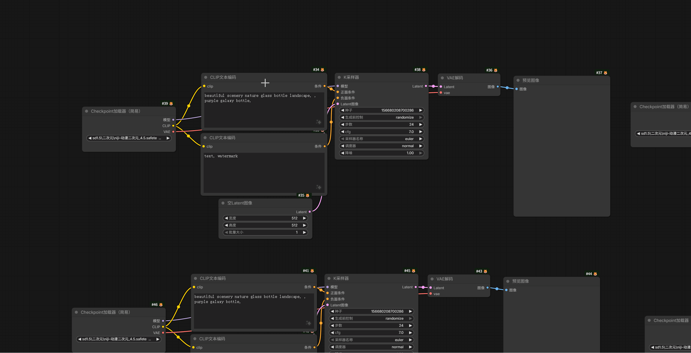

# ComfyUI AlignLayout

节点对齐、节点拉伸、自动布局、添加节点菜单、收藏节点菜单、快速连接、选择相同节点、替换节点

## 👁️ 功能速览

### 📍 节点对齐 (Align Panel)

- **功能**：快速将选中的多个节点对齐到同一基准线、均匀分布，并支持指定间距堆叠与自动布局。
  
  
- **快捷键**：`Alt + A`（可自定义）
- **亮点**：
    - 双模操作：点击触发或鼠标甩动触发
    - 环形菜单布局：上/下/左/右对齐、水平/垂直居中、垂直/水平平均分布
    - 底部控制栏：支持指定间距堆叠和自动布局
    - 智能交互：面板跟随鼠标、动态指示器、自动退出

---

### 📏 节点拉伸 (Stretch Panel)

- **功能**：统一节点尺寸，支持单侧拉伸、最大尺寸匹配和尺寸重置。

    

- **快捷键**：`Alt + S`（可自定义）
- **亮点**：
    - 环形菜单布局：上/下/左/右单侧拉伸、水平/垂直最大匹配、最小/默认尺寸重置
    - 双模操作：点击触发或鼠标甩动触发
    - 互斥模式：与对齐面板自动互斥显示
    - 智能交互：面板跟随鼠标、动态指示器

---

### ⚡ 自动布局 (Auto Layout)

- **功能**：一键智能整理节点布局，支持局部或全局整理。
  
    
  
- **快捷键**：`Alt + L`（默认，可自定义）
- **亮点**：
    - 支持逆向（推荐）和正向布局方向
    - 智能流式布局：自动识别独立节点组，端口感知排序
    - 防碰撞机制，防止节点重叠
    - 支持撤销操作

---

### ➕ 添加节点菜单 (Add Node Menu)

- **功能**：提供跟随鼠标的级联菜单，高效查找和添加节点。
  
  

- **快捷键**：`A`
- **亮点**：
    - 智能定位：首次居中，再次记忆上次分类
    - 拖拽置顶与节点收藏功能
    - 现代化深色磨砂玻璃风格UI
    - 配置本地存储，支持迁移备份

---

### 🚀 收藏节点菜单 (Quick Node Menu)

- **功能**：快速访问在添加节点菜单中收藏的节点。
  
  

- **快捷键**：`Q`
- **亮点**：
    - 与添加节点菜单数据联动
    - 独立置顶逻辑，可自定义排序
    - 紫色系高亮风格，与主菜单区分
    - 互斥显示：与添加节点菜单互斥

---

### 🔗 快速连接 (Fast Link)

- **功能**：通过智能算法实现极速的多对一、一对多、链式连接等操作。

    

- **快捷键列表**：
    - `F`：多对一（汇聚）
    - `Shift + F`：一对多（广播）
    - `Ctrl + F`：强制多对一
    - `Ctrl + Shift + F`：强制一对多
    - `Alt + F`：链式连接
    - `Ctrl + Shift + Alt + F`：清除内部连线
- **亮点**：
    - 支持轮询切换端口或节点
    - 智能保护连线，非强制模式不断开已有连接
    - 视觉列排序与严格左上排序算法
    - 高度可配置：阈值、超时、匹配优先级等

---

### 🔍 选择相同节点 (Select Same Nodes)

- **功能**：一键选中画布上所有与当前选中节点类型一致的节点。

    

- **快捷键**：`Shift + A`（可自定义）
- **亮点**：
    - 支持多类型同时选择
    - 配合排版工具可快速整理同类节点
    - 简单高效，适用于大型工作流整理

---

### 🔄 替换节点 (Replace Node)

- **功能**：以热替换方式将旧节点替换为新节点，自动迁移连线和参数。

    
    
- **快捷键**：`Shift + R`（可自定义）
- **亮点**：
    - 智能端口匹配策略：名称优先、类型唯一、强制顺序
    - 自动呼出搜索面板（可配置）
    - 支持批量替换相同类型节点
    - 高亮反馈与可自定义视觉样式
    - 支持撤销操作

<!-- TOC -->

<!-- INCLUDE:docs/modules/align.md -->

<!-- INCLUDE:docs/modules/stretch.md -->

<!-- INCLUDE:docs/modules/auto_layout.md -->

<!-- INCLUDE:docs/modules/add_node_menu.md -->

<!-- INCLUDE:docs/modules/quick_node_menu.md -->

<!-- INCLUDE:docs/modules/fast_link.md -->

<!-- INCLUDE:docs/modules/replace_node.md -->

<!-- INCLUDE:docs/modules/select_same_nodes.md -->

## 🤙 联系我们

如有问题请提交 Issue。

- bilibili：[噼哩画啦](https://space.bilibili.com/1370099549)

- 邮箱：pixixai@gmail.com
- 邮箱：pixixai@qq.com