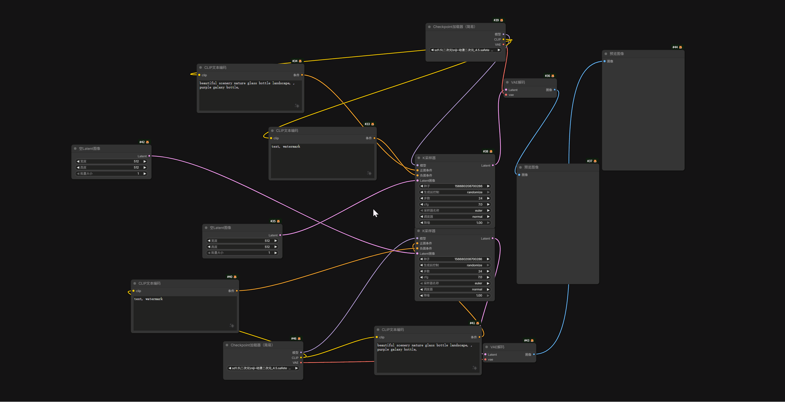

## ⚡ 自动布局 (Auto Layout)

**Auto Layout** 通过智能算法一键自动整理和排列您的工作流节点，让乱糟糟的画布瞬间变得井井有条。

### ✨ 主要功能 (Features)

- **原生节点组完美嵌套 (Native Group Nesting Support) 🔥**
    - **自底向上递归排布**：算法能完美识别甚至多层嵌套的节点组（Group）。它会优先对组内的子节点进行自动布局，排布整齐后，再将整个节点组打包作为一个“坚固的整体”参与外层的全局排布，确保复杂拓扑不乱套。
    - **标题栏智能避让 (Title-Aware Bounding Box)**：在为节点组生成包裹外框（套壳）时，算法会自动计算并避让内部最上方节点的“标题栏（Title Bar）”物理高度，彻底解决原生节点组中“外框压住内部节点标题”的视觉 Bug。
    - **精准的物理间距计算**：引入“安全天际线”游标算法，在垂直排布时完美扣除节点标题栏造成的视觉误差，确保您在设置中设定的“垂直/水平间距”以及“孤岛间距”像素级准确。
- **智能流式布局 (Smart Flow Layout)**
    - **独立流分组**：自动识别互不相关的节点组（连通分量/孤岛），将它们分开计算和排列，互不干扰。
    - **逆向推导模式（默认/推荐）**：以输出节点（如 `Save Image`）为终点，从右向左反向推导。同一列节点**向右对齐**，确保连线端口整齐划一。
    - **正向模式**：传统的从左向右排列。同一列节点**向左对齐**。
- **全新双向智能拓扑布局 (Smart Flow Layout)**
    - **对齐策略 (Alignment Strategy)**：支持起点对齐（Source-Aligned，保持同源分支起点整齐）或终点对齐（Sink-Aligned，强推末端节点对齐）。算法会根据策略智能推导节点深度。
    - **悬空节点智能吸附**：针对只有输出没有输入的“悬空节点”，算法会自动将它们向目标节点的前方拉拽并吸附，拒绝无效堆叠。
- **局部与全局整理 (Selection Aware)**
    - **局部整理**：选中一组节点，按下快捷键，仅自动排列选中的节点，不影响画布其他部分。
    - **全局整理**：点击画布空白处（取消所有选择），按下快捷键，自动整理整个工作流。
- **多端口严苛防交叉 (Multi-Port Anti-Crossing)**
    - **接口次序感知排序**：同一列的节点会严格根据它们连接的**端口物理顺序 (Slot Index)** 进行上下排列，彻底解决多线引出时的连线交叉与扭曲问题。
    - **防碰撞机制**：自动计算节点尺寸，防止节点重叠，并对齐单线连接的节点。
- **智能对齐与防重叠**
    - **端口感知排序**：同一列的节点会根据它们连接到下一列节点的**输入端口顺序**进行上下排列（例如：连接到 `Model` 端口的节点会排在连接到 `VAE` 端口的节点上方）。
    - **智能顶对齐**：单输出节点会自动与其目标节点进行顶部对齐，视觉更整洁。
- **高度可配置 (Fully Configurable)**
    - 支持自定义**水平间距**、**垂直间距**和**孤岛间距**。
    - 支持自定义**快捷键**（默认为 `Alt+L`，支持组合键如 `Ctrl+Shift+K`）。
    - 原生集成到 ComfyUI 设置面板，支持多语言（中文/英文）。

### 🚀 使用方法 (Usage)

#### 快捷键

默认快捷键为 **`Alt + L`**。

#### 操作演示

1. **整理选中的节点**：
    - 使用鼠标框选一部分乱序的节点。
    - 按下 `Alt + L`。
    - 节点将在当前位置附近自动吸附并排列整齐。
2. **整理所有节点**：
    - 点击画布空白处确保没有节点被选中。
    - 按下 `Alt + L`。
    - 所有节点将以画布右侧（逆向模式）或左侧（正向模式）为基准重新排列。

> 提示：该操作支持撤销！如果不满意自动排列的结果，请按下 Ctrl + Z 即可恢复原状。

### ⚙️ 设置说明 (Configuration)

点击 ComfyUI 菜单栏的 **设置 (Settings)** 图标（齿轮），在左侧侧边栏找到 **"AlignLayout"** 选项卡。

#### Auto Layout (自动布局)

- **Layout Direction (布局方向)**
    - **Right-to-Left (逆向 - 推荐)**：从右向左排列，节点群从右侧基准向左侧铺开。
    - **Left-to-Right (正向)**：从左向右排列，节点群从左侧基准向右侧铺开。
- **Alignment Strategy (对齐策略)**
    - **Source-Aligned (起点对齐 - 推荐)**：优先保证同源分支的起点在同一列，使分支节点排布紧凑不松散。
    - **Sink-Aligned (终点对齐)**：强制把所有路线的末端输出节点推至同一列，适合需要严格对齐输出口的排版需求。
- **Horizontal / Vertical Spacing (水平 / 垂直间距)**
    - 控制节点间、列与列之间的像素间距（默认 30 / 10）。
- **Island Direction / Gap (孤岛方向 / 间距)**
    - 控制互不相连的多个独立工作流块是垂直堆叠还是水平并排。
- **Shortcut (快捷键)**
    - 自定义触发自动布局的组合键。默认为 `Alt+L`。
